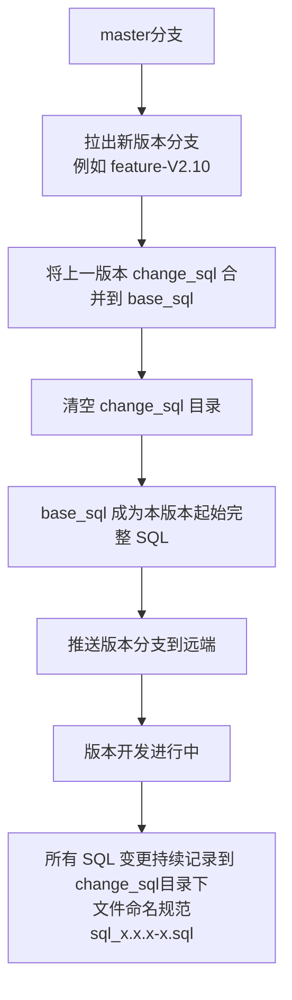

# 数据库规范

本文档是数据库变更的统一规范，所有涉及数据库结构或数据的开发工作均须严格遵守。

规范的目的不是约束，是保证多服务、多团队协作下 SQL 的一致性、可维护性与部署安全性。


---

**仓库地址**：以当前项目的版本 SQL 仓库为准。


---

## 仓库目录结构

```
common/
├── base_sql/          # 当前版本最终完整 SQL
│   ├── db_main.sql
│   ├── db_operation.sql
│   └── db_device_job.sql
└── change_sql/        # 当前版本增量变更 SQL
    └── sql_x.x.x-x.sql
```

* `base_sql/`：各业务库在**当前版本**下的完整基线 SQL。拉出新版本分支时，先将上一版本的 `change_sql/` 合并进来并清空；在当前版本开发开始时，它是本版本的起始基线；在发布前完成合并后，它也是本版本的最终交付 SQL。
* `change_sql/`：当前版本开发期间的**增量变更** SQL。当前版本所有数据库变更都记录在这里，下一个版本拉分支时统一合并进 `base_sql/`。


---

## SQL 文件管理规范

### 产物说明

`base_sql/` 目录下的三个文件是当前版本的最终交付 SQL：

| 文件                | 对应业务库 |
| ------------------- | ---------- |
| `db_main.sql`       | 业务主库   |
| `db_operation.sql`  | 运维监控库 |
| `db_device_job.sql` | 设备任务库 |

`base_sql/` 在版本开发开始时代表当前版本的完整基线；发布前将 `change_sql/` 全量合并后，代表当前版本的最终交付 SQL，并作为下一个版本继承的基础。

`change_sql/` 目录用于保存当前版本开发期间的增量 SQL，文件命名统一为 `sql_x.x.x-x.sql`。

### 分支发布流程



拉新版本分支时必须遵循以下步骤：


1. 从 `master`拉出新版本分支。
2. 分支创建后，立即将上一版本的 `change_sql/` 变更完整合并到 `base_sql/`。
3. 清空 `change_sql/` 目录，此时 `base_sql/` 成为当前版本的起始完整 SQL。
4. 推送版本分支。
5. 当前版本开发期间，所有数据库变更统一记录在 `change_sql/`。
6. 发布并推送当前版本分支。


---

## SQL 编写规范

### 1. 数据库命名

所有 SQL 中的数据库名必须使用 `${DBNAME}` 变量占位，禁止硬编码数据库名称，便于在不同环境（开发、测试、生产）中统一替换。

```sql
-- 正确
CREATE TABLE IF NOT EXISTS ${DBNAME}.`t_device` ( ... );
INSERT INTO ${DBNAME}.`t_config` ...;

-- 错误
CREATE TABLE IF NOT EXISTS db_main.`t_device` ( ... );
```


---

### 2. 表命名

| 规则 | 说明                                                |
| ---- | --------------------------------------------------- |
| 前缀 | 必须以 `t_` 开头                                    |
| 格式 | 小写字母 + 下划线分隔（snake_case）                 |
| 示例 | `t_device`、`t_monitor_alarm`、`t_product_category` |


---

### 3. 字段命名与基础字段

字段名统一使用 **snake_case**（小写 + 下划线）。

所有表必须包含以下 6 个基础字段，且**字段顺序固定**，位于业务字段之前：

| 字段          | 说明                               |
| ------------- | ---------------------------------- |
| `id`          | 自增主键                           |
| `create_time` | 创建时间                           |
| `create_user` | 创建人                             |
| `update_time` | 更新时间                           |
| `update_user` | 修改人                             |
| `is_deleted`  | 逻辑删除标记（0=未删除，1=已删除） |

> 所有删除操作使用逻辑删除，不得物理删除数据。查询时须过滤 `is_deleted = 0`。


---

### 4. 标准字段定义

主键及基础字段的**标准写法**如下，不得随意变更类型或精度：

```sql
`id`          BIGINT(20) UNSIGNED NOT NULL AUTO_INCREMENT PRIMARY KEY COMMENT '自增主键',
`create_time` DATETIME(3) NOT NULL DEFAULT CURRENT_TIMESTAMP(3) COMMENT '创建时间',
`create_user` VARCHAR(50) NOT NULL COMMENT '创建人',
`update_time` DATETIME(3) NOT NULL DEFAULT CURRENT_TIMESTAMP(3) ON UPDATE CURRENT_TIMESTAMP(3) COMMENT '更新时间',
`update_user` VARCHAR(50) NOT NULL COMMENT '修改人',
`is_deleted`  TINYINT(1) UNSIGNED NOT NULL DEFAULT '0' COMMENT '是否删除',
```

**关键约束：**

* `PRIMARY KEY` 必须与 `id` 字段写在**同一行**，不允许单独另起一行定义。
* 时间字段必须使用 `DATETIME(3)`（毫秒级精度），默认值使用 `CURRENT_TIMESTAMP(3)`，不得使用 `DATETIME` 或 `TIMESTAMP`。


---

### 5. 表级声明（强制）

每张表的结尾必须完整声明以下三项，缺一不可：

```sql
) ENGINE=InnoDB DEFAULT CHARSET = utf8mb4 COLLATE = utf8mb4_bin COMMENT = '表的中文说明';
```

| 项目              | 要求          | 说明                         |
| ----------------- | ------------- | ---------------------------- |
| `ENGINE`          | `InnoDB`      | 支持事务和行锁               |
| `DEFAULT CHARSET` | `utf8mb4`     | 支持完整 Unicode（含 emoji） |
| `COLLATE`         | `utf8mb4_bin` | 区分大小写的二进制排序       |
| `COMMENT`         | 必填          | 表的中文业务说明             |


---

### 6. 字段级字符集

**禁止**在字段级别单独指定 `CHARACTER SET` 或 `COLLATE`（特殊需求须经评审）。字符集统一继承表级默认设置，避免混乱。

```sql
-- 错误（禁止）
`name` VARCHAR(50) CHARACTER SET utf8mb4 COLLATE utf8mb4_bin NOT NULL COMMENT '名称',

-- 正确
`name` VARCHAR(50) NOT NULL COMMENT '名称',
```


---

### 7. 索引命名

| 索引类型 | 关键字         | 命名前缀 | 示例                               |
| -------- | -------------- | -------- | ---------------------------------- |
| 普通索引 | `KEY`          | `idx_`   | `idx_tenant_id`、`idx_create_time` |
| 唯一索引 | `UNIQUE KEY`   | `uk_`    | `uk_product_key`、`uk_device_sn`   |
| 全文索引 | `FULLTEXT KEY` | `idx_`   | `idx_unit_name`                    |

**强制规则：**

* 统一使用 `KEY` 关键字，**禁止使用** `INDEX`。
* 索引名与字段名均须用**反引号**包裹。

```sql
KEY `idx_tenant_id` (`tenant_id`),
KEY `idx_create_time` (`create_time`),
UNIQUE KEY `uk_product_key` (`product_key`),
FULLTEXT KEY `idx_unit_name` (`unit_name`)
```


---

### 8. 注释规范

* 每个**字段**必须添加 `COMMENT`，描述字段的业务含义。
* 每张**表**必须添加 `COMMENT`，描述表的业务用途。
* 注释使用中文，简洁清晰，不得留空。


---

### 9. INSERT 语句

同一张表的多条初始化数据必须**合并为一条** `INSERT` 语句，禁止拆分为多条。

```sql
-- 正确（推荐）
INSERT INTO ${DBNAME}.`t_config` (`name`, `value`, `create_user`, `update_user`) VALUES
  ('config1', 'value1', 'system', 'system'),
  ('config2', 'value2', 'system', 'system'),
  ('config3', 'value3', 'system', 'system');

-- 错误（禁止）
INSERT INTO ${DBNAME}.`t_config` (`name`, `value`, `create_user`, `update_user`) VALUES ('config1', 'value1', 'system', 'system');
INSERT INTO ${DBNAME}.`t_config` (`name`, `value`, `create_user`, `update_user`) VALUES ('config2', 'value2', 'system', 'system');
```


---

### 10. ALTER 语句

`change_sql/` 中可以存在 `ALTER` 语句，用于记录当前版本期间的结构变更。

处理原则：


1. `change_sql/` 中可以包含 `ALTER` 语句，用于记录版本期间的结构变更。
2. 发布前，所有 `ALTER` 变更须手动合并到 `base_sql/` 对应文件中。
3. 合并完成后，`base_sql/` 才代表当前版本的最终交付结果。
4. 发布完成后，`change_sql/` 目录需要清空。

```
change_sql 中的 ALTER（版本记录）
           ↓
  发布前手动合并到 base_sql
           ↓
   base_sql 成为当前版本最终 SQL
           ↓
      清空 change_sql
```


---

## 完整建表示例

以下是符合所有规范的完整建表示例，新增表时以此为模板：

```sql
CREATE TABLE IF NOT EXISTS ${DBNAME}.`t_product` (
  `id`                  BIGINT(20) UNSIGNED NOT NULL AUTO_INCREMENT PRIMARY KEY COMMENT '自增主键',
  `create_time`         DATETIME(3) NOT NULL DEFAULT CURRENT_TIMESTAMP(3) COMMENT '创建时间',
  `create_user`         VARCHAR(50) NOT NULL COMMENT '创建人',
  `update_time`         DATETIME(3) NOT NULL DEFAULT CURRENT_TIMESTAMP(3) ON UPDATE CURRENT_TIMESTAMP(3) COMMENT '更新时间',
  `update_user`         VARCHAR(50) NOT NULL COMMENT '修改人',
  `is_deleted`          TINYINT(1) UNSIGNED NOT NULL DEFAULT 0 COMMENT '是否删除',
  `tenant_id`           BIGINT(20) UNSIGNED NOT NULL COMMENT '租户id',
  `product_key`         VARCHAR(50) NOT NULL COMMENT '产品key',
  `product_secret`      VARCHAR(50) NOT NULL COMMENT '产品秘钥',
  `name`                VARCHAR(30) NOT NULL COMMENT '名称',
  `category_id`         BIGINT(20) UNSIGNED COMMENT '品类id',
  `category_name`       VARCHAR(30) COMMENT '品类名称',
  `node_type`           INT UNSIGNED NOT NULL COMMENT '节点类型',
  `gateway_protocol`    INT UNSIGNED COMMENT '接入网关协议',
  `network_method`      INT UNSIGNED NOT NULL COMMENT '连网方式',
  `protocol`            INT UNSIGNED NOT NULL COMMENT '协议',
  `data_format`         INT UNSIGNED NOT NULL COMMENT '数据格式',
  `check_type`          INT UNSIGNED NOT NULL COMMENT '校验类型',
  `verification_method` INT UNSIGNED NOT NULL COMMENT '认证方式',
  `status`              INT UNSIGNED NOT NULL DEFAULT 1 COMMENT '状态',
  `dynamic_register`    INT UNSIGNED NOT NULL DEFAULT 1 COMMENT '动态注册',
  `description`         VARCHAR(100) COMMENT '描述',
  UNIQUE KEY `uk_product_key` (`product_key`),
  KEY `idx_create_time` (`create_time`),
  KEY `idx_tenant_id` (`tenant_id`),
  KEY `idx_name` (`name`),
  KEY `idx_status` (`status`)
) ENGINE=InnoDB DEFAULT CHARSET = utf8mb4 COLLATE = utf8mb4_bin COMMENT = '产品';
```


---

## 提交检查清单

在提交 SQL 变更前，请逐项确认：

- [ ] 数据库名使用 `${DBNAME}` 变量，未硬编码
- [ ] 表名以 `t_` 开头，使用 snake_case
- [ ] 基础 6 个字段齐全，顺序正确，定义符合标准
- [ ] `PRIMARY KEY` 与 `id` 在同一行
- [ ] 时间字段使用 `DATETIME(3)` 毫秒精度
- [ ] 表尾声明 `ENGINE=InnoDB`、`DEFAULT CHARSET=utf8mb4`、`COLLATE=utf8mb4_bin`、`COMMENT`
- [ ] 字段级别未单独指定字符集或排序规则
- [ ] 索引使用 `KEY` 关键字，命名符合 `idx_` / `uk_` 前缀规范
- [ ] 每个字段和表均有 `COMMENT`
- [ ] 同表 INSERT 已合并为单条语句
- [ ] 当前版本增量 SQL 已写入 `change_sql/sql_x.x.x-x.sql`
- [ ] 拉出新版本分支时已将上一版本 `change_sql/` 完整合并到 `base_sql/`
- [ ] 合并完成后已清空 `change_sql/`
