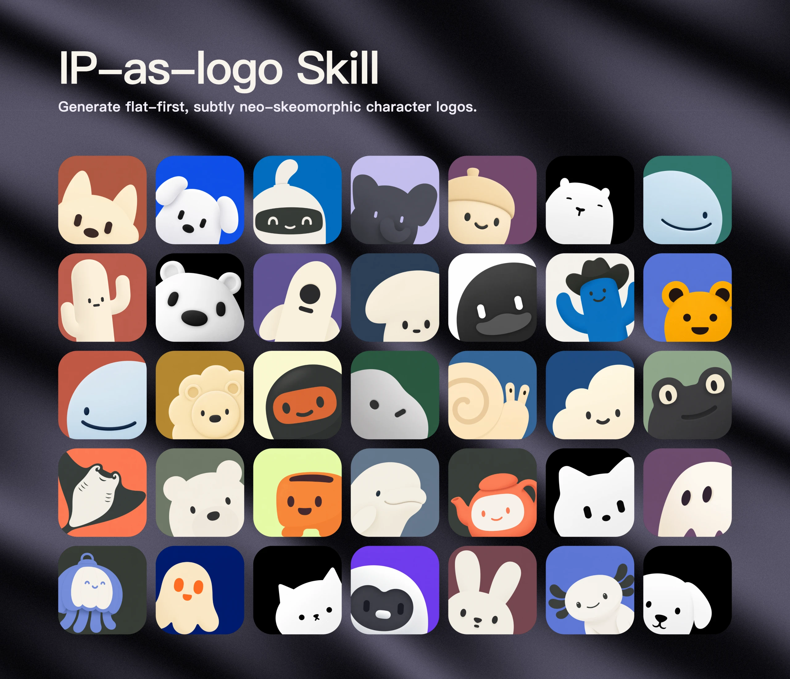

# IP as Logo

`ip-as-logo` 是一个紧凑专注的 Agent Skill，用于为产品打造极致简约、可爱、可直接商用的拟人化 IP 角色符号。其核心设计哲学聚焦于：讨喜的亲和力魅力、饱满圆润的几何剪影、严苛的复杂度控制、标志性的下角探出构图，以及纯净的单色背景。

遵循开放的 Agent Skills 标准规范，可无缝运行于任何兼容的 AI 编码与自主 Agent 环境中。



## 核心设计法则

- **极简剪影**：由约 4–7 个大型基础几何形构筑饱满连贯的外轮廓；
- **三语义色**：全图默认严格采用 3 种语义颜色（2 种 IP 主体色 + 1 种背景纯色）；
- **标准工作流**：先提出 3 种构思方向，经用户确认后单次批量生成 6 个独立候选；
- **主体偏好**：以大众熟知度高、亲和力强的小动物为主要切入点；物品、机器或虚构生物需与产品特质有明确关联；
- **微质感与克制色彩**：主体与背景形成清晰对比，背景适度降低饱和度以呈现柔和内敛的高级感，通过单一句子触发微妙立体感，避免复杂的渐变与光影堆砌；
- **圆润形态**：线条厚重饱满，彻底剔除尖锐刺角或脆弱细线；
- **角落探出式构图**：角色立姿从左下角或右下角探出，占据画布 85–95% 的主导面积；
- **默认 3:3 平衡分布**：6 张候选图中，3 张从左下角探出，3 张从右下角探出；
- **极度幼态与软萌**：突出婴儿般无辜可爱的面部比例，坚决删除非必要的细碎描边与装饰；
- **纯色背景**：背景完全铺满纯色，提示词中不使用 `opaque`、`alpha` 等底层图像术语；
- **提示词隔离**：发给生图模型的 Prompt 仅将产物描述为“正方形角色图像”，严禁出现 `logo`、`app icon` 等可能诱发模型生成复杂图标样机的字眼；
- **单次抽卡交付**：生成的候选结果全部原样保留并交付用户挑选，不搞自动化拦截或私下重绘。

## 安装指南

使用 Agent Skills CLI 安装本 Skill：

```bash
npx skills@latest add s1dashu/ip-as-logo-skill
```

全局安装（跨项目可用）：

```bash
npx skills@latest add s1dashu/ip-as-logo-skill --global
```

## Agent 环境兼容性

支持包含 **Codex, Coze, 豆包, YouMind, Manus, Gemini Apps, Replit Agent** 等现代 AI Agent。使用本 Skill 需要 Agent 环境已集成图像生成工具能力。

## 目录结构

```text
SKILL.md                      # 核心执行规范与提示词模板
assets/ip-as-logo-wall.webp   # 示例展示画廊
README.md                     # 本说明文档
LICENSE                       # 许可文件
```

## 开源许可

MIT License
