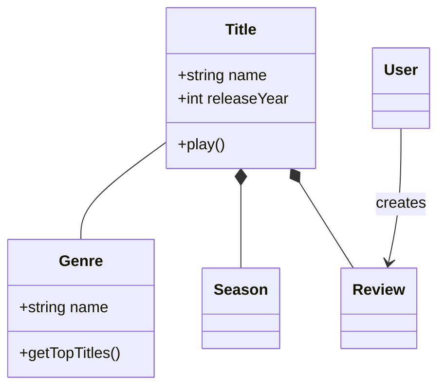
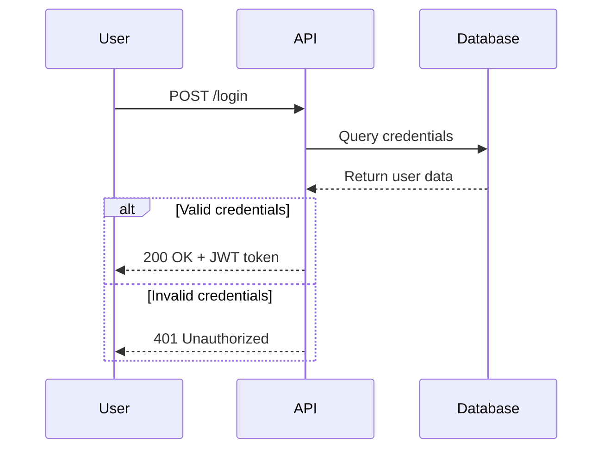
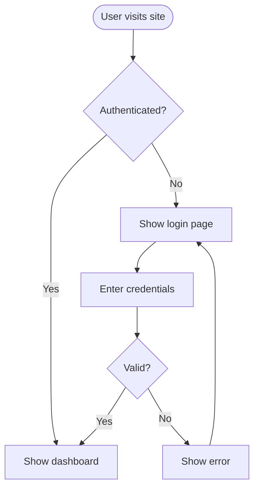
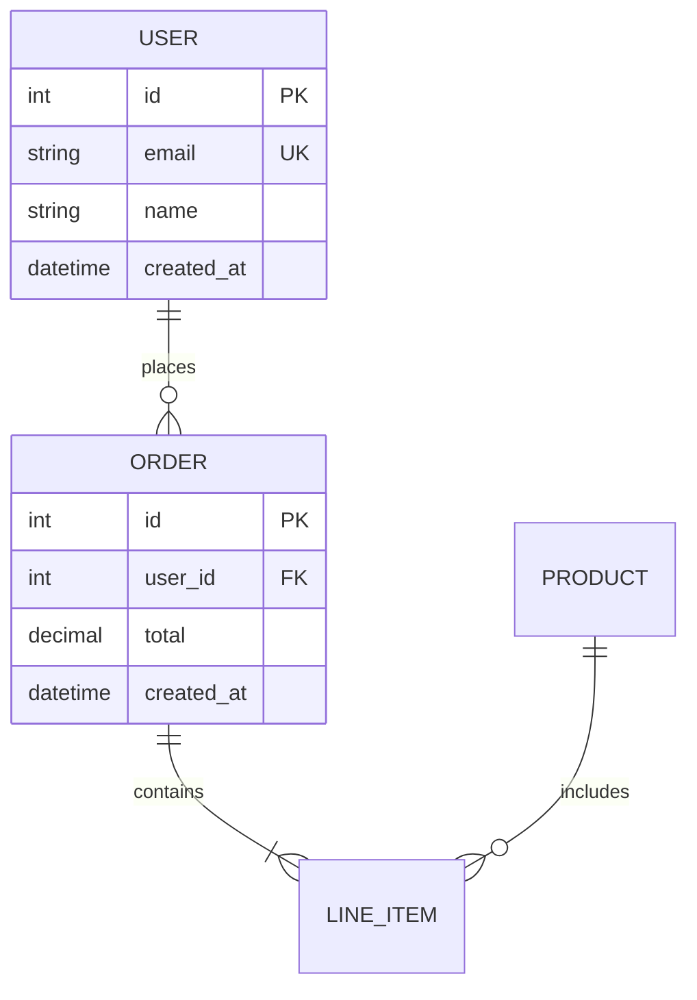
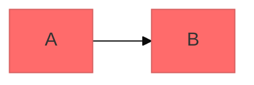

# Mermaid Diagramming

Create professional software diagrams using Mermaid's text-based syntax. Mermaid renders diagrams from simple text definitions, making diagrams version-controllable, easy to update, and maintainable alongside code.

## Core Syntax Structure

All Mermaid diagrams follow this pattern:

```mermaid
diagramType
  definition content
```

**Key principles:**
- First line declares diagram type (e.g., `classDiagram`, `sequenceDiagram`, `flowchart`)
- Use `%%` for comments
- Line breaks and indentation improve readability but aren't required
- Unknown words break diagrams; parameters fail silently

## Diagram Type Selection Guide

**Choose the right diagram type:**

1. **Class Diagrams** - Domain modeling, OOP design, entity relationships
   - Domain-driven design documentation
   - Object-oriented class structures
   - Entity relationships and dependencies

2. **Sequence Diagrams** - Temporal interactions, message flows
   - API request/response flows
   - User authentication flows
   - System component interactions
   - Method call sequences

3. **Flowcharts** - Processes, algorithms, decision trees
   - User journeys and workflows
   - Business processes
   - Algorithm logic
   - Deployment pipelines

4. **Entity Relationship Diagrams (ERD)** - Database schemas
   - Table relationships
   - Data modeling
   - Schema design

5. **C4 Diagrams** - Software architecture at multiple levels
   - System Context (systems and users)
   - Container (applications, databases, services)
   - Component (internal structure)
   - Code (class/interface level)

6. **State Diagrams** - State machines, lifecycle states
7. **Git Graphs** - Version control branching strategies
8. **Gantt Charts** - Project timelines, scheduling
9. **Pie/Bar Charts** - Data visualization

## Quick Start Examples

### Class Diagram (Domain Model)


### Sequence Diagram (API Flow)


### Flowchart (User Journey)


### ERD (Database Schema)


## Detailed References

For in-depth guidance on specific diagram types, see:

- **[references/class-diagrams.md](references/class-diagrams.md)** - Domain modeling, relationships (association, composition, aggregation, inheritance), multiplicity, methods/properties
- **[references/sequence-diagrams.md](references/sequence-diagrams.md)** - Actors, participants, messages (sync/async), activations, loops, alt/opt/par blocks, notes
- **[references/flowcharts.md](references/flowcharts.md)** - Node shapes, connections, decision logic, subgraphs, styling
- **[references/erd-diagrams.md](references/erd-diagrams.md)** - Entities, relationships, cardinality, keys, attributes
- **[references/c4-diagrams.md](references/c4-diagrams.md)** - System context, container, component diagrams, boundaries
- **[references/architecture-diagrams.md](references/architecture-diagrams.md)** - Cloud services, infrastructure, CI/CD deployments
- **[references/advanced-features.md](references/advanced-features.md)** - Themes, styling, configuration, layout options

## Best Practices

1. **Start Simple** - Begin with core entities/components, add details incrementally
2. **Use Meaningful Names** - Clear labels make diagrams self-documenting
3. **Comment Extensively** - Use `%%` comments to explain complex relationships
4. **Keep Focused** - One diagram per concept; split large diagrams into multiple focused views
5. **Version Control** - Store `.mmd` files alongside code for easy updates
6. **Add Context** - Include titles and notes to explain diagram purpose
7. **Iterate** - Refine diagrams as understanding evolves

## Configuration and Theming

Configure diagrams using frontmatter:



**Available themes:** default, forest, dark, neutral, base

**Layout options:**
- `layout: dagre` (default) - Classic balanced layout
- `layout: elk` - Advanced layout for complex diagrams (requires integration)

**Look options:**
- `look: classic` - Traditional Mermaid style
- `look: handDrawn` - Sketch-like appearance

## Exporting and Rendering

命令行导出前先阅读 [CLI 兼容性契约](references/cli-compatibility.md)。本机已在 WSL2 上验证 `mmdc 11.16.0` 的版本探测、帮助信息、Markdown 多图提取及 SVG 渲染；版本号只是已验证基线，实际使用前仍需探测当前命令能力并完成与任务图类型匹配的最小渲染。

**Native support in:**
- GitHub/GitLab - Automatically renders in Markdown
- VS Code - With Markdown Mermaid extension
- Notion, Obsidian, Confluence - Built-in support

**Export options:**
- [Mermaid Live Editor](https://mermaid.live) - Online editor with PNG/SVG export
- Mermaid CLI - 已安装时先用 `mmdc --version`、`mmdc --help` 和最小图验证，再执行 `mmdc -i input.mmd -o output.png`；未安装时获得用户授权后运行 `npm install -g @mermaid-js/mermaid-cli`
- Docker - 本机未验证；获得用户授权后选择明确镜像 tag，先验证 `mmdc --version` 和最小图，不要用未固定的默认 tag 作为兼容性依据

## Common Pitfalls

- **Breaking characters** - Avoid `{}` in comments, use proper escape sequences for special characters
- **Syntax errors** - Misspellings break diagrams; validate syntax in Mermaid Live
- **Overcomplexity** - Split complex diagrams into multiple focused views
- **Missing relationships** - Document all important connections between entities

## When to Create Diagrams

**Always diagram when:**
- Starting new projects or features
- Documenting complex systems
- Explaining architecture decisions
- Designing database schemas
- Planning refactoring efforts
- Onboarding new team members

**Use diagrams to:**
- Align stakeholders on technical decisions
- Document domain models collaboratively
- Visualize data flows and system interactions
- Plan before coding
- Create living documentation that evolves with code
