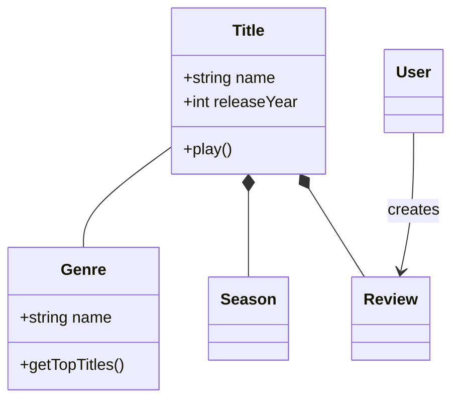
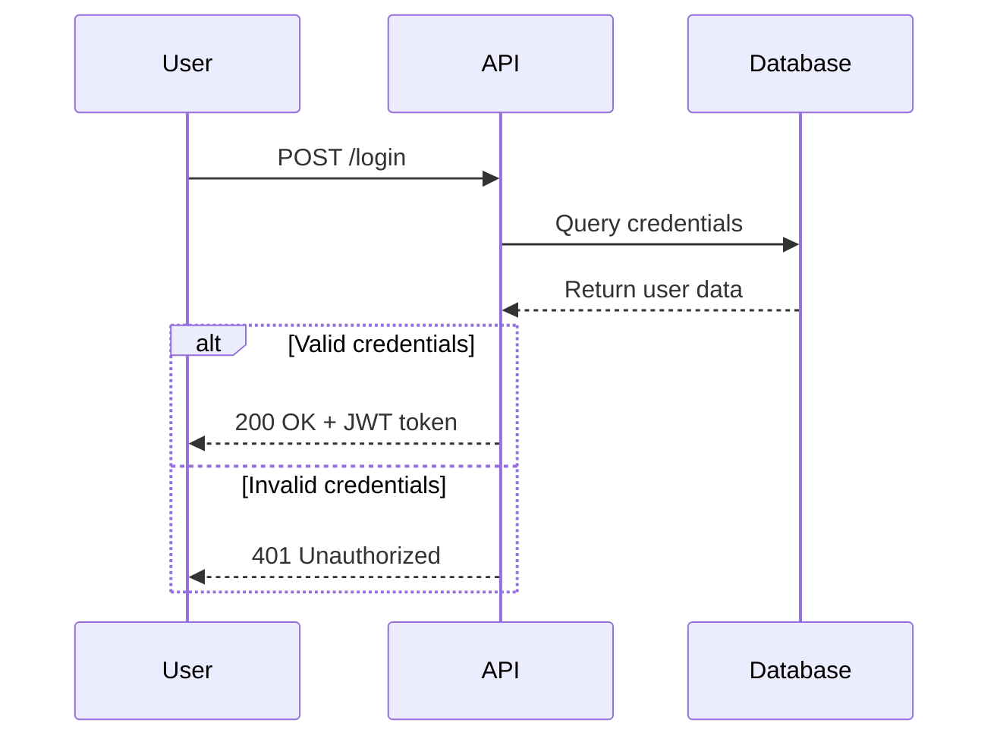
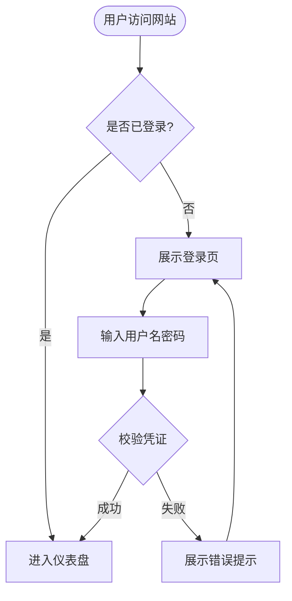

---
metadata:
  external-cli: "true"
  cli-compatibility: "references/cli-compatibility.md"
name: mermaid-diagrams
description: 使用 Mermaid 语法创建并维护软件图表。Use when 用户需要 `.mmd` 文件、Markdown 内嵌的 Mermaid 代码块、可版本控制的图表文档，或需要编写流程图、时序图、ERD、C4 架构图、状态机图、Git 分支图、饼图、柱状图或甘特图等；不用于主要交付物为可编辑 Draw.io XML 或独立品牌化 HTML/SVG/PNG 重绘的场景。
---

# Mermaid Diagramming

使用 Mermaid 声明式文本语法创建专业、规范的软件图表。Mermaid 能够根据简洁的文本定义直接渲染各类结构图，使软件设计图能够与代码一同纳入版本控制，便于维护、检索与协同迭代。

## 核心语法结构

所有 Mermaid 图表均遵循以下基础范式：

```mermaid
diagramType
  definition content
```

**关键书写原则：**
- 首行声明图表类型（例如 `classDiagram`、`sequenceDiagram`、`flowchart`、`erDiagram`）；
- 使用 `%%` 进行单行注释；
- 换行与缩进能够显著提高文本可读性（虽非语法强制要求）；
- 未知关键字会导致渲染中断，未识别的参数则可能静默失效。

## 图表类型选型指南

**根据业务场景挑选最合适的图表类型：**

1. **类图（Class Diagrams）**：领域建模、面向对象设计、实体与依赖关系
   - 领域驱动设计（DDD）模型文档化；
   - 面向对象类结构与继承分层；
   - 核心实体关系与接口依赖。
2. **时序图（Sequence Diagrams）**：时间维度的交互逻辑、消息传递流水
   - API 请求与响应处理流；
   - 用户身份认证与授权握手；
   - 微服务或模块间交互时序；
   - 核心方法或事件的分步调用。
3. **流程图（Flowcharts）**：业务流程、算法分支、决策树
   - 用户旅程（User Journey）与操作动线；
   - 业务处理逻辑与分支流转；
   - 算法分支与循环判断；
   - CI/CD 自动化构建部署流水线。
4. **实体关系图（ERD）**：数据库表结构与建模
   - 关系型数据库外键与多对多关系；
   - 领域数据模型设计；
   - Schema 规范与字段约束。
5. **C4 架构图（C4 Diagrams）**：多层级软件系统架构
   - 系统上下文（System Context：系统与外部用户/系统边界）；
   - 容器视图（Container：应用服务、数据库、外部 API 分布）；
   - 组件视图（Component：单个服务内部核心组件划分）；
   - 代码视图（Code：关键类与接口实现层级）。
6. **状态图（State Diagrams）**：状态机、生命周期状态变迁。
7. **Git 分支图（Git Graphs）**：分支策略与合并演进模型。
8. **甘特图（Gantt Charts）**：项目里程碑、排期与阶段规划。
9. **饼图/柱状图（Pie/Bar Charts）**：数据可视化分析。

## 快速入门示例

### 类图（领域模型示例）


### 时序图（API 请求流程）


### 流程图（用户认证动线）


### 实体关系图（数据库 Schema）

```mermaid
erDiagram
    USER ||--o{ ORDER : places
    ORDER ||--|{ LINE_ITEM : contains
    PRODUCT ||--o{ LINE_ITEM : includes

    USER {
        int id PK
        string email UK
        string name
        datetime created_at
    }

    ORDER {
        int id PK
        int user_id FK
        decimal total
        datetime created_at
    }
```


## 专项参考文档索引

针对特定图表类型的深入设计与语法指南：

- **[references/class-diagrams.md](references/class-diagrams.md)**：领域建模、关联/组合/聚合/继承关系、基数多重性、属性与方法语法；
- **[references/sequence-diagrams.md](references/sequence-diagrams.md)**：参与者、同步/异步消息、激活条、循环与分支块（alt/opt/par）、便签注解；
- **[references/flowcharts.md](references/flowcharts.md)**：各类节点形态、连线样式、子图（Subgraphs）分组与自定义排版；
- **[references/erd-diagrams.md](references/erd-diagrams.md)**：实体定义、基数关系标度、主外键标识与字段类型属性；
- **[references/c4-diagrams.md](references/c4-diagrams.md)**：系统上下文图、容器图、组件图与系统边界划分；
- **[references/architecture-diagrams.md](references/architecture-diagrams.md)**：云服务拓扑、基础设施集成与 CI/CD 部署架构；
- **[references/advanced-features.md](references/advanced-features.md)**：主题定制、高级样式配置、布局引擎选项。

## 最佳工程实践

1. **先骨架后细节**：从核心实体与主要链路起步，逐步递进补充次要细节与边界；
2. **具象化命名**：使用语义明确的标签和连线说明，使图表具备自解释能力；
3. **关键处善用注释**：通过 `%%` 记录不易直接体现的业务决策与复杂关系原因；
4. **单一图表聚焦单一主题**：一张图表达一个核心概念；庞大复杂的全景系统应拆分为多重视角；
5. **代码同仓纳管**：将 `.mmd` 文件或 Markdown 嵌入图表与项目源码同仓存放并提交版本控制；
6. **提供必要上下文**：搭配简明的标题与说明文字，阐明图表的核心目的；
7. **持续跟随迭代**：当业务架构与代码发生变更时，同步刷新对应 Mermaid 图表。

## 配置项与主题定制

可通过 Frontmatter 为图表声明专属配置：


**可用内置主题：** `default`, `forest`, `dark`, `neutral`, `base`

**布局算法选项：**
- `layout: dagre`（默认）：经典平衡布局；
- `layout: elk`：面向复杂连线图的高级布局引擎（需要环境集成支持）。

**视觉外观选项：**
- `look: classic`：传统清晰的 Mermaid 工程矢量风格；
- `look: handDrawn`：手绘涂鸦质感风格。

## 导出与渲染支持

在命令行导出前先阅读 [CLI 兼容性契约](references/cli-compatibility.md)。本机已在 WSL2 上验证 `mmdc 11.16.0` 的版本探测、帮助信息、Markdown 多图提取及 SVG 渲染；版本号属于已验证基线，实际使用前仍需探测当前命令能力并完成与任务图类型匹配的最小渲染。

**主流平台原生支持：**
- GitHub / GitLab：Markdown 文档原生渲染；
- VS Code：安装 Markdown Mermaid 扩展即可实时预览；
- Notion、Obsidian、Confluence：内置完备的 Mermaid 渲染支持。

**导出方式与工具：**
- [Mermaid Live Editor](https://mermaid.live)：在线编辑器，支持直接导出 PNG/SVG；
- Mermaid CLI：已安装时先用 `mmdc --version`、`mmdc --help` 和最小图验证，再执行 `mmdc -i input.mmd -o output.png`；未安装时获得用户明确授权后运行 `npm install -g @mermaid-js/mermaid-cli`；
- Docker 导出：本机未验证；获得用户授权后指定明确的镜像 tag，先验证 `mmdc --version` 与最小图，切勿使用未固定的默认 tag 作为兼容性依据。

## 常见排错与陷阱

- **字符冲突与转义**：避免在注释或标签中随意使用未转义的特殊括号（如 `{}`），特殊字符应合理使用引号包裹；
- **拼写错误中断**：Mermaid 对拼写错误容错率较低，语法错误会导致整个图表渲染失败；
- **过度复杂化**：单图节点过多会导致排版混乱，应积极按业务模块拆解为多张局部图；
- **丢失关键关系**：确保核心实体间的依赖与数据流向完整无遗漏。
