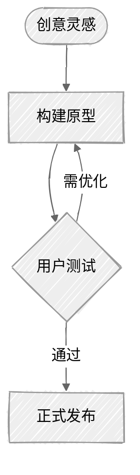

# 主题配置、排版引擎与高级特性（Advanced Features）

通过 Frontmatter 配置与现代主题引擎深度定制 Mermaid 图表的视觉呈现。

## 基于 Frontmatter 的全局配置

可以在图表代码块的最顶层声明 Frontmatter，覆盖主题、字体与排版引擎：

## 内置主题选项速查

| 主题名称 | 适用风格 |
|---|---|
| `default` | 经典蓝绿配色，默认标准风格 |
| `forest` | 绿色大自然系风格，适合数据与环境类 |
| `dark` | 暗色模式，适合集成进深色主题文档 |
| `neutral` | 黑白灰纯素雅工程图风格，适合正式技术白皮书 |
| `base` | 纯白板基底，完全由 `themeVariables` 变量自由接管控制 |

## 视觉外观模式（Look）

在支持 Mermaid 最新特性的渲染引擎中配置：
- `look: classic`：传统的清晰规整矢量风格；
- `look: handDrawn`：自然洒脱的手绘草图质感风格。

## 排版布局引擎选择

- `layout: dagre`（默认引擎）：平衡、快速，兼容所有环境；
- `layout: elk`（日食高级引擎）：适合处理节点与跨层级连线极度密集的复杂系统拓扑，有效减少线条交叉穿透。
