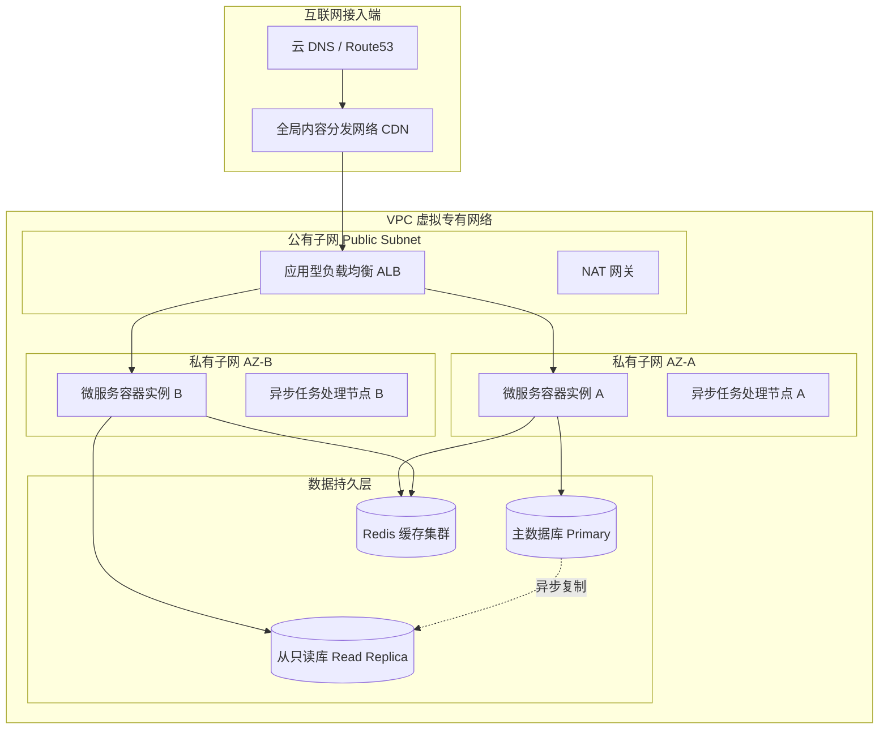
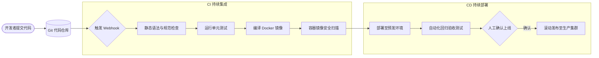

# 云架构与基础设施图设计指南（Architecture Diagrams）

用于直观表达现代云原生基础设施、跨可用区容灾、微服务网格与 CI/CD 构建流水线。

## 云原生高可用架构范例

结合子图与正交连线绘制经典的云端多可用区（Multi-AZ）生产部署架构：

```mermaid
flowchart TB
    subgraph 互联网接入端
        DNS[云 DNS / Route53]
        CDN[全局内容分发网络 CDN]
    end

    subgraph VPC 虚拟专有网络
        subgraph 公有子网 Public Subnet
            ALB[应用型负载均衡 ALB]
            NAT[NAT 网关]
        end

        subgraph 私有子网 AZ-A
            AppA[微服务容器实例 A]
            WorkerA[异步任务处理节点 A]
        end

        subgraph 私有子网 AZ-B
            AppB[微服务容器实例 B]
            WorkerB[异步任务处理节点 B]
        end

        subgraph 数据持久层
            DB_Master[(主数据库 Primary)]
            DB_Replica[(从只读库 Read Replica)]
            RedisCluster[(Redis 缓存集群)]
        end
    end

    DNS --> CDN
    CDN --> ALB
    ALB --> AppA
    ALB --> AppB
    AppA --> RedisCluster
    AppB --> RedisCluster
    AppA --> DB_Master
    AppB --> DB_Replica
    DB_Master -. 异步复制 .-> DB_Replica
```

## CI/CD 自动化流水线拓扑

```mermaid
flowchart LR
    Dev([开发者提交代码]) --> Git[(Git 代码仓库)]
    Git --> Webhook{触发 Webhook}

    subgraph CI 持续集成
        Webhook --> Lint[静态语法与规范检查]
        Lint --> Unit[运行单元测试]
        Unit --> Build[编译 Docker 镜像]
        Build --> Scan[容器镜像安全扫描]
    end

    subgraph CD 持续部署
        Scan --> Staging[部署至预发环境]
        Staging --> E2E[自动化回归验收测试]
        E2E --> Approval{人工确认上线}
        Approval -->|确认| Prod[滚动发布至生产集群]
    end
```
