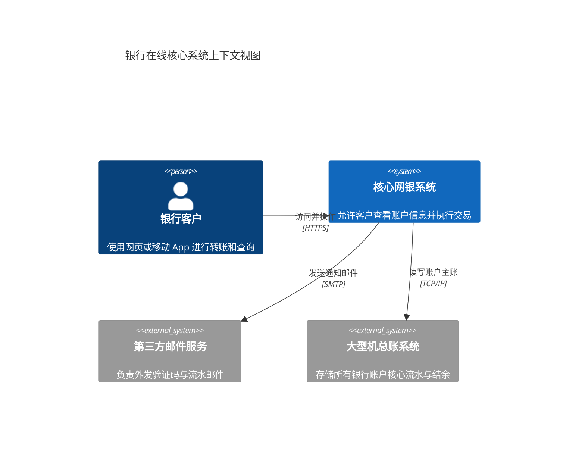
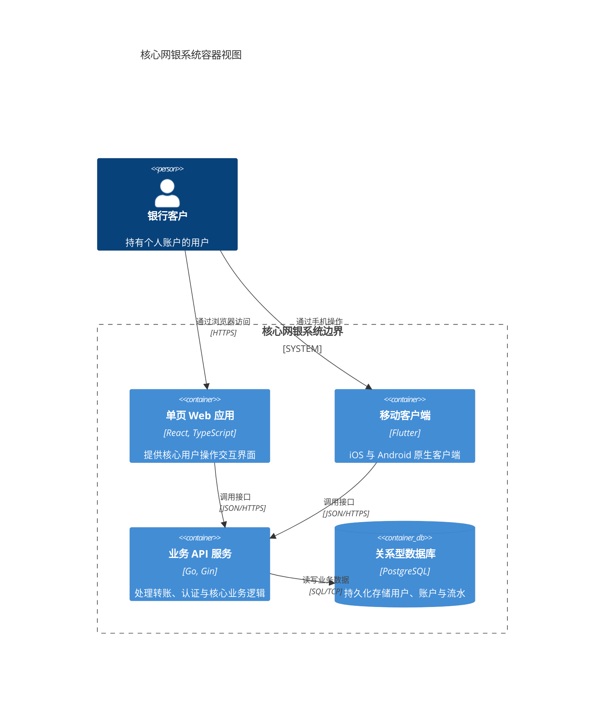
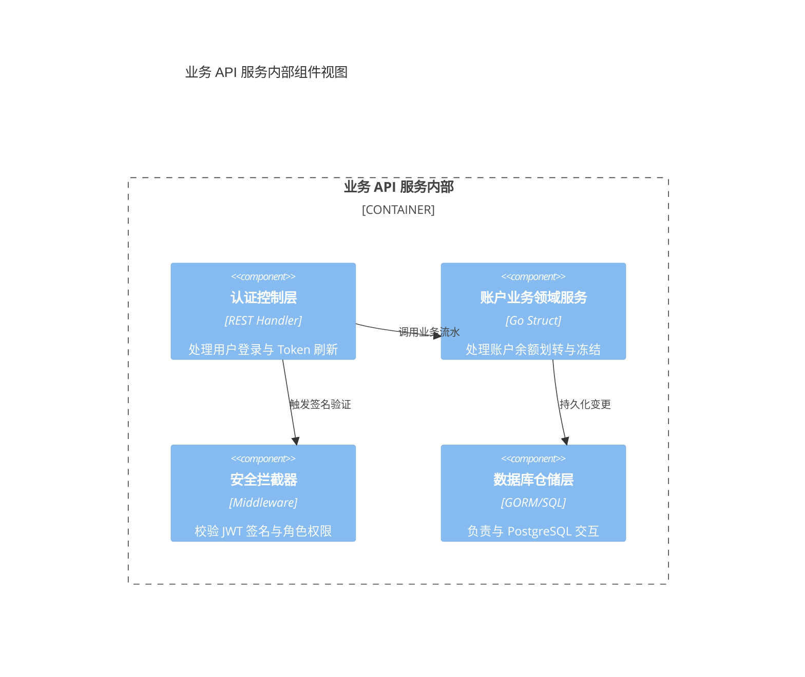

# C4 软件架构图设计指南（C4 Architecture）

C4 模型是一种通过不同抽象层级描述软件架构的经典方法论，包含：上下文（Context）、容器（Container）、组件（Component）与代码（Code）。Mermaid 提供了针对 C4 语法的原生支持。

## 1. 系统上下文图（System Context - C4Context）

展示目标系统与外部用户、第三方系统之间的宏观边界：

## 2. 容器图（Container - C4Container）

展开系统内部的高层技术架构（如前端单页应用、后端 API、数据库）：

## 3. 组件图（Component - C4Component）

聚焦在单个微服务容器内部，展示内部模块与关键职责划分：

