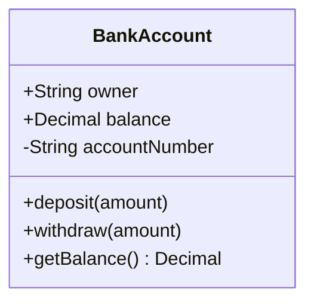
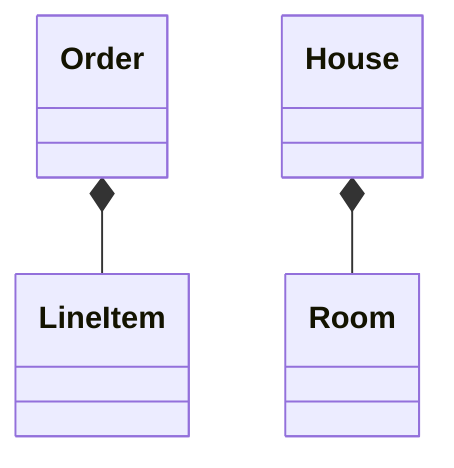
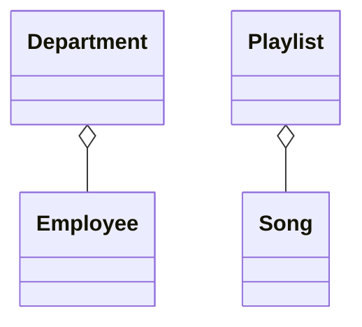
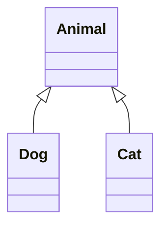
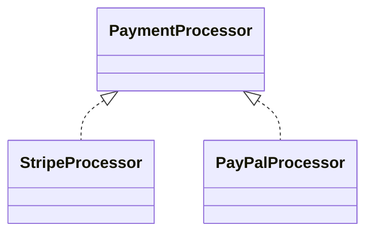
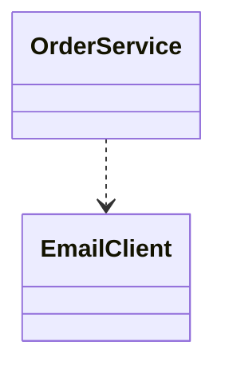
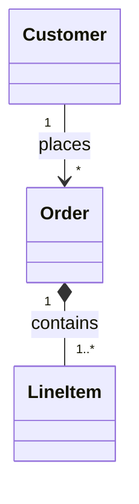
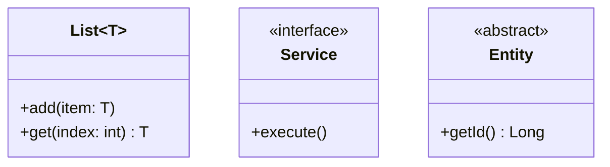

# 类图设计与语法指南（Class Diagrams）

类图用于面向对象架构设计与领域驱动建模（DDD），表达系统中的实体类、属性方法及其拓扑关系。

## 基础语法范式

```mermaid
classDiagram
    ClassName
```

## 定义包含成员属性与方法的类



**可见性修饰符（Visibility）：**
- `+` 公开（Public）
- `-` 私有（Private）
- `#` 受保护（Protected）
- `~` 包内访问 / 内部（Package/Internal）

**成员语法格式：**
- `+类型 属性名`：声明属性及其数据类型
- `+方法名(参数列表) 返回值类型`：声明方法签名与返回类型

## 核心依赖关系语法

### 关联关系（Association：`--`）
松散的关联，彼此相互引用但生命周期完全独立。


### 组合关系（Composition：`*--`）
强所属关系（生命周期绑定）。子对象不可脱离父对象单独存在；父对象销毁时子对象一并销毁。



### 聚合关系（Aggregation：`o--`）
弱所属关系（“包含/Has-a”）。子对象可以脱离聚合体独立存在。



### 继承与泛化关系（Inheritance：`<|--`）
面向对象的“Is-a”继承关系。子类派生自父类。



### 接口实现关系（Realization：`<|..`）
具体类实现声明的接口契约。



### 依赖关系（Dependency：`..>`）
单向临时使用关系。某个类的具体方法临时接收另一个类作为参数。



## 基数与重数标注（Multiplicity）



常见基数标记：
- `1`：恰好一个
- `0..1`：零或一个（可选）
- `*` 或 `0..*`：零或多个
- `1..*`：一个或多个

## 泛型与注解标注


