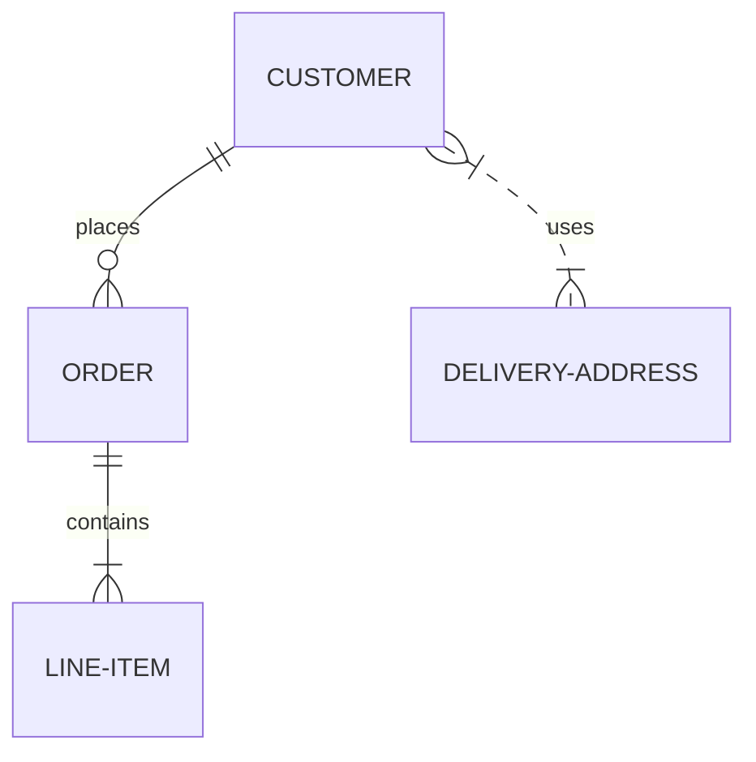
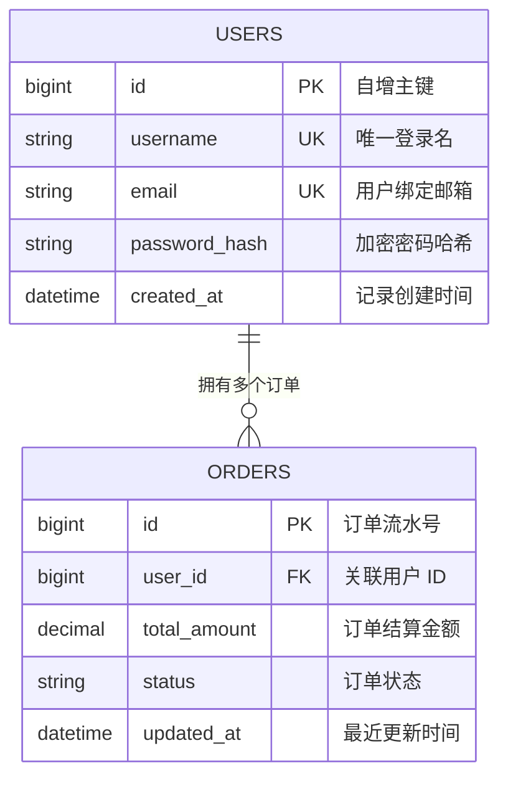

# 实体关系图设计指南（ERD Diagrams）

实体关系图（Entity Relationship Diagram）用于数据库建模、数据结构规划与表间外键约束梳理。

## 基础语法范式

## 关系基数语法速查（Cardinality）

Mermaid 使用独特的符号精确表示关系型数据库的“基数”（一或多、必选或可选）：

| 符号语法 | 语义含义 |
|---|---|
| `||--||` | 严格一对一（One to One） |
| `||--o|` | 一对零或一（One to Zero or One，可选） |
| `||--|{` | 一对一或多（One to One or More，强制至少一个） |
| `||--o{` | 一对零或多（One to Many，经典主外键关系） |
| `}|--|{` | 强制多对多（Many to Many） |
| `}|--o{` | 可选多对多（Many to Many） |

使用实线 `--` 表示强识别性关系（Identifying relationship）；使用虚线 `..` 表示非识别性弱关联。

## 实体属性与字段定义

**字段修饰标记：**
- `PK`：主键（Primary Key）
- `FK`：外键（Foreign Key）
- `UK`：唯一键（Unique Key）
- 双引号文本：字段中文备注与说明
