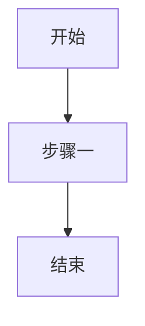
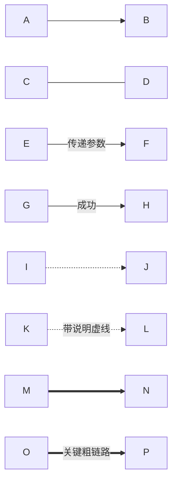
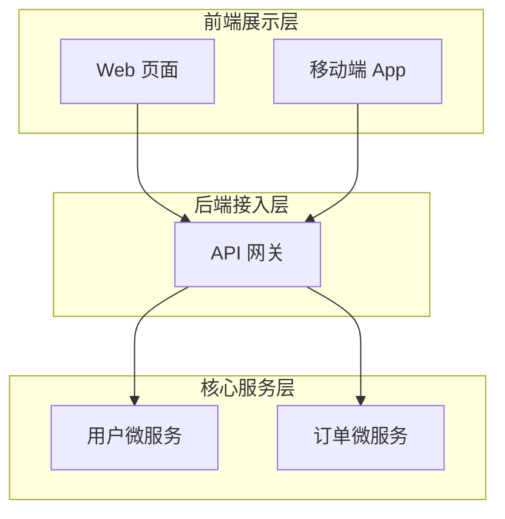
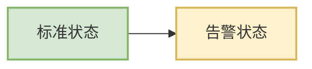

# 流程图与子图布局指南（Flowcharts）

流程图能够直观表达业务逻辑动线、算法分支决策与 CI/CD 自动化流水线。

## 方向与基础语法

**主流方向声明：**
- `TD` 或 `TB`：自上而下（Top-Down / Top-to-Bottom）
- `BT`：自下而上（Bottom-to-Top）
- `LR`：自左向右（Left-to-Right）
- `RL`：自右向左（Right-to-Left）

## 图元形状语法速查

| 语法书写 | 呈现图元形状 | 常见业务用途 |
|---|---|---|
| `[矩形节点]` | 直角矩形 | 标准处理步骤、计算、状态赋值 |
| `(圆角矩形)` | 圆角矩形 | 开始 / 结束或轻量动作 |
| `([胶囊形])` | 跑道胶囊形（Stadium） | 标准流程起点或终点 |
| `[[子流程]]` | 带有双侧竖线的子流程框 | 封装好的复杂子流程或外部模块调用 |
| `[(数据库)]` | 圆柱形容器 | 数据库表、持久化存储 |
| `((圆形))` | 纯圆形节点 | 状态分支汇聚点、简易计数器 |
| `>不对称旗形]` | 右侧带旗帜切角的非对称框 | 触发事件、广播通知 |
| `{条件菱形}` | 决策菱形（Rhombus） | 条件判断分支（If/Else） |
| `{{六角形}}` | 六边形准备框 | 循环预处理、初始化操作 |
| `[/平行四边形/]` | 前倾平行四边形 | 用户输入 / 屏幕输出操作 |
| `[\反向平行四边形\]` | 后倾平行四边形 | 特殊 I/O 读取 |
| `[/梯形\]` | 正梯形 | 手工人工操作确认 |

## 连线与带文本流向语法

## 子图分组（Subgraphs）

通过子图对关联业务模块进行清晰的分区管理：

## 自定义样式与 ClassDef

