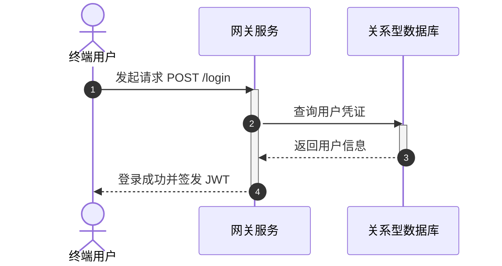
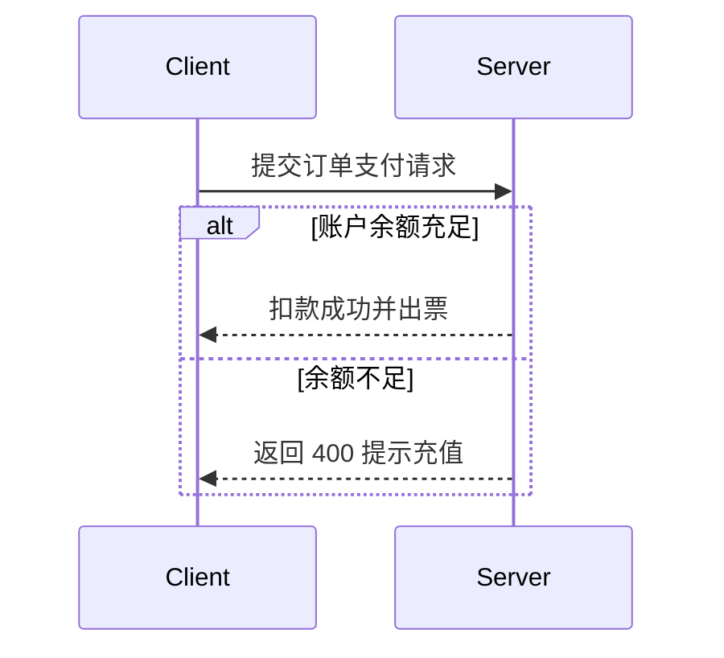
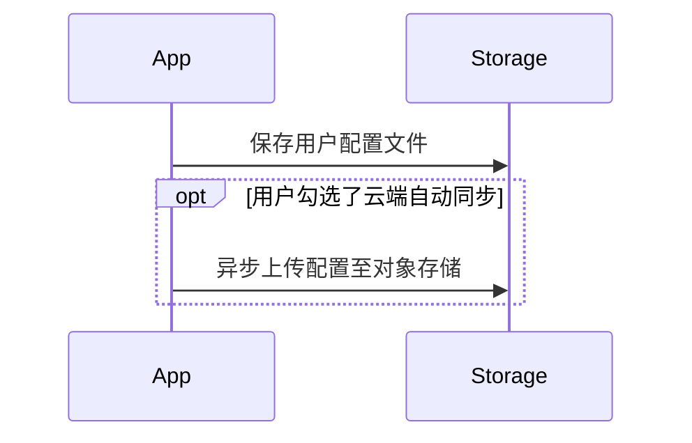
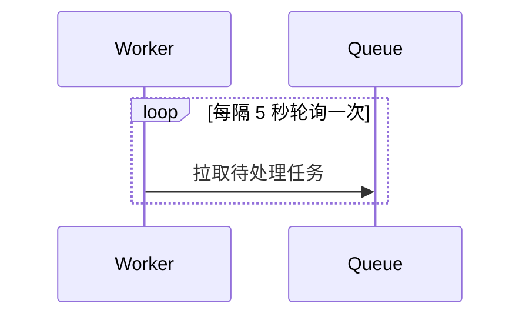
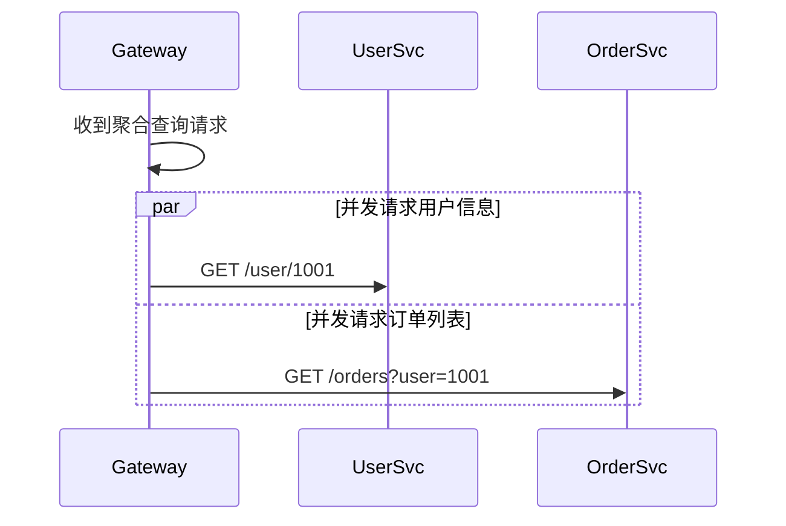
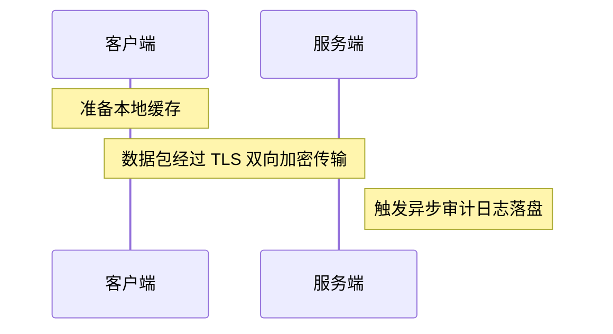

# 时序图深入设计指南（Sequence Diagrams）

时序图用于在时间维度上直观展示参与者之间的消息交互、API 调用链路与生命周期状态。

## 核心参与者语法（Participants）

**参与者定义类型：**
- `actor`：代表真实的人类用户或外部系统角色
- `participant`：代表软件模块、微服务、网关或数据库

## 消息箭头语法速查

| 箭头语法 | 含义说明 |
|---|---|
| `->` | 无箭头的实线（同步发起） |
| `->>` | 带实心箭头的实线（同步调用请求） |
| `-->` | 无箭头的虚线（异步发起） |
| `-->>` | 带实心箭头的虚线（同步响应返回） |
| `-x` | 带叉号的实线（消息传输中丢失或失败） |
| `--x` | 带叉号的虚线（返回响应丢失） |
| `-)` | 异步事件发送（无等待即刻返回） |
| `--))` | 异步响应返回 |

## 逻辑分支与循环块控制

### 1. 条件分支（alt / else）

### 2. 可选流程（opt）

### 3. 循环遍历（loop）

### 4. 并行并发执行（par / and）

## 便签注解与高亮（Notes）

