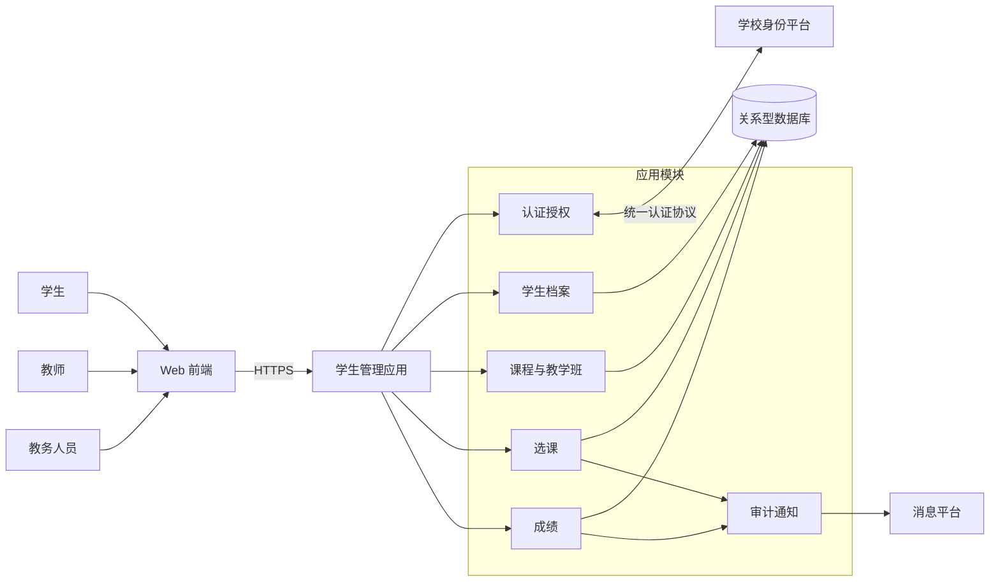
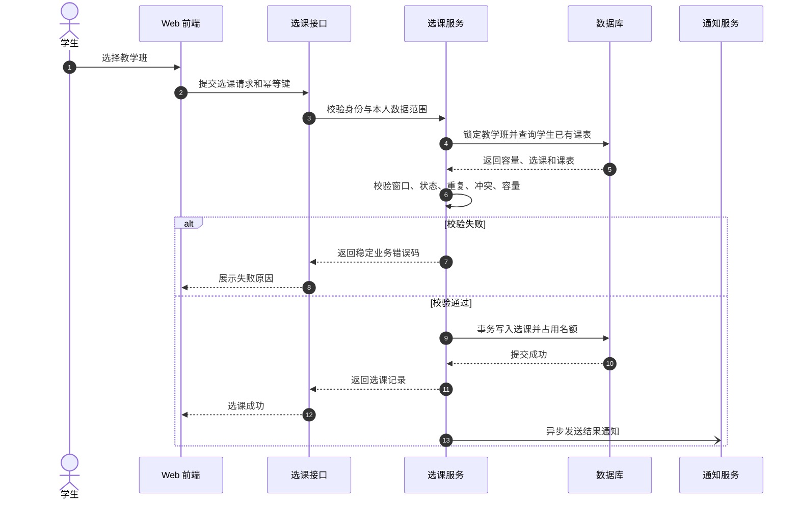

# 学生管理系统软件设计（精简示例）

> 本文只示范标准版设计文档的结构、证据边界和图表密度，不代表真实学校的完整需求或固定技术选型。

## 文档信息

| 项目 | 内容 |
| --- | --- |
| 版本/状态 | 0.1 / 方案示例 |
| 形成方式 | 需求驱动设计 |
| 目标读者 | 产品、开发、测试、运维 |

## 1. 背景与范围

学校需要统一管理学生档案、课程、教学班、选课和成绩，减少重复录入并保证关键变更可追踪。

- 范围内：学生档案、课程与教学班、选课、成绩、权限和审计。
- 范围外：招生录取、收费、宿舍、在线学习和排课优化。
- 待确认：统一身份协议、成绩更正审批层级、选课峰值容量和数据保留期限。

## 2. 核心需求与设计约束

| 编号 | 需求或约束 | 验收方式 |
| --- | --- | --- |
| FR-01 | 教务人员维护学生、课程和教学班 | 权限与增删改查测试 |
| FR-02 | 学生只能为本人选课和退课 | 身份绑定与越权测试 |
| FR-03 | 选课校验开放时间、重复、冲突和容量 | 规则与并发测试 |
| FR-04 | 教师录入本人教学班成绩，发布后受控更正 | 状态与权限测试 |
| NFR-01 | 选课不得超卖，重复请求不得重复选课 | 最后名额并发测试、幂等测试 |
| NFR-02 | 关键操作可审计，敏感字段默认脱敏 | 审计完整性和数据泄露测试 |

设计假设：采用前后端分离的模块化单体；关系型数据库是业务事实源；通知失败不回滚选课或成绩事务。以上为示例决策，真实项目必须重新确认。

## 3. 总体架构



| 模块 | 核心职责 | 关键边界 |
| --- | --- | --- |
| 认证授权 | 登录、角色权限、本人/教学班/院系数据范围 | 后端执行最终授权判断 |
| 学生档案 | 学生主数据与学籍状态 | 状态变化保留历史，不物理删除事实 |
| 课程与教学班 | 课程、学期、教师、容量和课表 | 课程是主数据，教学班是学期开课实例 |
| 选课 | 资格、重复、冲突、容量和选退课 | 校验与写入处于同一事务 |
| 成绩 | 录入、提交、发布和更正 | 发布后通过更正记录修改 |
| 审计通知 | 关键操作留痕和结果通知 | 通知异步，失败可重试 |

## 4. 核心数据设计

```mermaid
erDiagram
    STUDENT ||--o{ ENROLLMENT : 选课
    COURSE ||--o{ COURSE_OFFERING : 开设
    TERM ||--o{ COURSE_OFFERING : 安排
    TEACHER ||--o{ COURSE_OFFERING : 授课
    COURSE_OFFERING ||--o{ ENROLLMENT : 包含
    ENROLLMENT ||--o| GRADE : 产生
    GRADE ||--o{ GRADE_CHANGE : 更正

    STUDENT {
        bigint id PK
        varchar student_no UK
        varchar name
        varchar academic_status
        int version
    }
    COURSE {
        bigint id PK
        varchar course_code UK
        varchar name
        decimal credit
    }
    TERM {
        bigint id PK
        varchar term_code UK
        date start_date
        date end_date
    }
    TEACHER {
        bigint id PK
        varchar teacher_no UK
        varchar name
    }
    COURSE_OFFERING {
        bigint id PK
        bigint course_id FK
        bigint term_id FK
        bigint teacher_id FK
        int capacity
        int enrolled_count
        int version
    }
    ENROLLMENT {
        bigint id PK
        bigint student_id FK
        bigint offering_id FK
        varchar status
        timestamp enrolled_at
    }
    GRADE {
        bigint id PK
        bigint enrollment_id FK UK
        decimal score
        varchar status
        int version
    }
    GRADE_CHANGE {
        bigint id PK
        bigint grade_id FK
        decimal before_score
        decimal after_score
        varchar approval_status
    }
```

关键约束：

- `student_no`、`course_code`、`teacher_no` 全局唯一；
- `(student_id, offering_id)` 唯一，数据库约束兜底防止重复选课；
- 选课事务锁定教学班并重新检查容量，成功后同时写选课记录和人数；
- 每条有效选课最多一条成绩；成绩更正保留前后值和审批信息。

## 5. 核心选课时序



选课事务完成前不发送成功通知；通知失败进入重试，不回滚已经提交的选课。

## 6. 核心接口

| 方法 | 路径 | 用途 | 关键约束 |
| --- | --- | --- | --- |
| `GET` | `/api/v1/offerings` | 查询可选教学班 | 按学期、院系分页 |
| `POST` | `/api/v1/enrollments` | 选课 | 本人或授权代办、幂等键 |
| `POST` | `/api/v1/enrollments/{id}/withdraw` | 退课 | 时间窗口、幂等处理 |
| `PUT` | `/api/v1/offerings/{id}/grades` | 暂存或提交成绩 | 任课教师、乐观锁 |
| `POST` | `/api/v1/offerings/{id}/grades/publish` | 发布成绩 | 教务权限、完整性检查 |

统一约定：JSON、版本化路径、结构化错误码、ISO 8601 时间、分页上限、链路 ID；选退课接口使用幂等键，版本冲突返回 HTTP 409。

## 7. 质量与安全设计

| 关注点 | 设计 | 验证 |
| --- | --- | --- |
| 并发一致性 | 唯一约束、教学班行锁或等效并发控制 | 并发竞争最后名额，无超卖 |
| 权限 | 角色权限加数据范围，前端隐藏不替代后端校验 | 学生、教师、院系间越权测试 |
| 隐私 | 证件号、电话等字段加密或脱敏 | 页面、导出和日志检查 |
| 审计 | 记录选退课、成绩发布/更正、权限和导出 | 审计字段完整且不可由普通用户删除 |
| 韧性 | 外部调用超时；通知可重试；核心事务独立 | 消息平台故障演练 |
| 可观测性 | 请求量、分位延迟、选课成功率、锁等待和通知积压 | 仪表盘与告警演练 |

性能目标和 RPO/RTO 未由示例需求给出，因此不虚构数值；正式设计应由业务和运维共同确认后写入可验证指标。

## 8. 关键风险与待确认项

| 类型 | 内容 | 影响 |
| --- | --- | --- |
| 风险 | 选课峰值超过数据库事务能力 | 需基于实际容量压测并制定限流方案 |
| 风险 | 历史学生与成绩数据质量不一致 | 需多轮试迁移、差错隔离和业务核验 |
| 待确认 | 是否支持候补和自动递补 | 影响选课状态、队列、事务和通知 |
| 待确认 | 成绩更正审批层级 | 影响状态机、权限和审计模型 |
| 待确认 | 统一身份协议和账号绑定方式 | 影响登录、用户表和应急方案 |

## 9. 追踪示例

| 需求 | 模块 | 数据/API | 验证 |
| --- | --- | --- | --- |
| FR-02 本人选课 | 认证授权、选课 | `POST /enrollments`、`enrollment` | 身份绑定和横向越权测试 |
| FR-03 选课规则 | 选课、课程与教学班 | `course_offering`、`enrollment` | 重复、冲突、最后名额并发测试 |
| FR-04 成绩发布 | 成绩 | `grade`、`grade_change` | 任课权限、状态和更正历史测试 |
