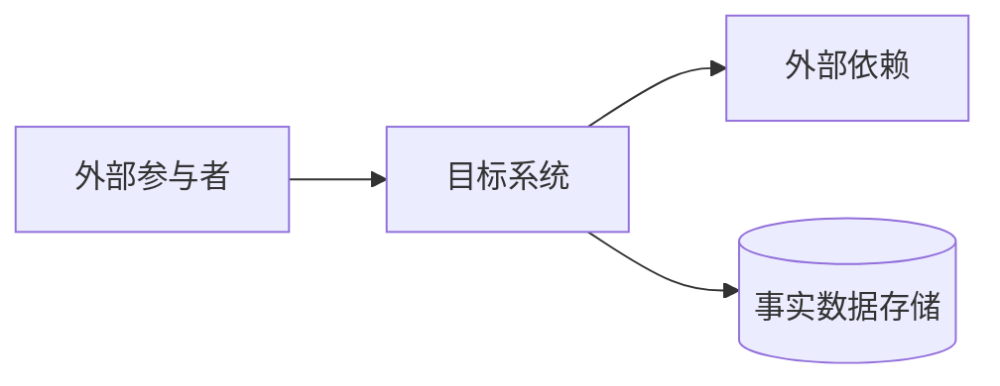
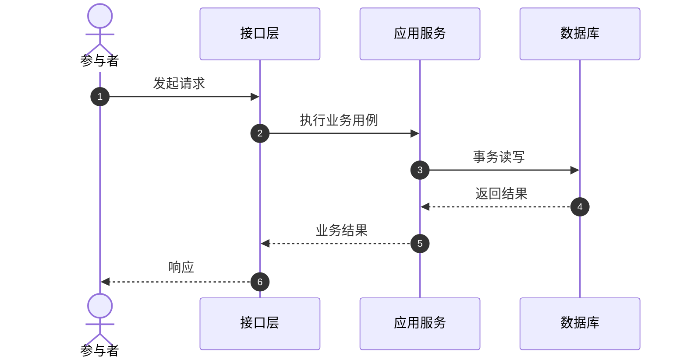
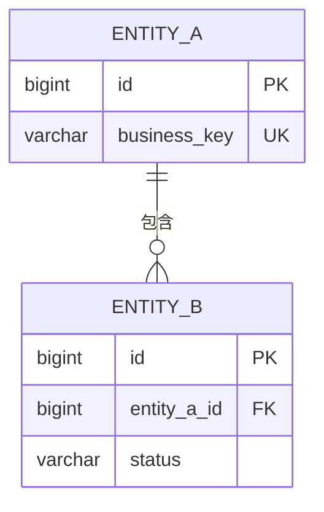

# 【系统或功能名称】软件设计文档

> 使用说明：按任务深度裁剪章节，删除本说明和无信息章节。`【待填写】` 表示需要从需求、代码或用户确认中取得内容，不得凭空补全。

## 文档信息

| 项目 | 内容 |
| --- | --- |
| 版本/状态 | 【待填写】 |
| 日期 | 【待填写】 |
| 责任角色 | 【待填写】 |
| 目标读者 | 【待填写】 |
| 形成方式 | 需求驱动设计 / 基于代码逆向整理 / 增量维护 |
| 事实基准 | 【需求版本、代码 revision、工作区状态或变更范围】 |

### 修订记录

| 版本 | 日期 | 修订人/责任角色 | 修订内容 | 状态 |
| --- | --- | --- | --- | --- |
| 【待填写】 | 【待填写】 | 【待填写】 | 【待填写】 | 【草案/评审中/已批准】 |

## 1. 背景与范围

### 1.1 背景和目标

【说明系统或功能为什么存在、解决什么业务或技术问题，以及需要达成的可验证目标。不要描述本次分析、逆向或文档编写任务。】

### 1.2 范围

- 范围内：【待填写】
- 范围外：【待填写】
- 外部依赖：【待填写】

### 1.3 约束与待确认项

| 类型 | 内容 | 影响 |
| --- | --- | --- |
| 已确认约束 | 【待填写】 | 【待填写】 |
| 待确认 | 【待填写】 | 【待填写】 |

## 2. 需求与质量属性摘要

| 编号 | 需求或场景 | 验收标准 | 状态/证据 |
| --- | --- | --- | --- |
| FR-01 | 【核心需求】 | 【可验证结果】 | 【已确认/推断/建议/待确认】 |
| NFR-01 | 【质量属性】 | 【数值或验证方式】 | 【已确认/建议目标】 |

## 3. 总体架构

【解释系统边界、组件职责、依赖方向、数据事实源和关键取舍。】

| 模块 | 职责 | 拥有的数据 | 依赖 |
| --- | --- | --- | --- |
| 【模块】 | 【职责】 | 【数据】 | 【依赖】 |

## 4. 核心流程

### 4.1 【核心流程名称】

- 前置条件：【待填写】
- 主路径：【待填写】
- 失败路径：【待填写】
- 事务/一致性边界：【待填写】
- 权限与审计：【待填写】

## 5. 数据设计

| 实体/表 | 用途 | 关键字段与约束 | 生命周期 |
| --- | --- | --- | --- |
| 【实体】 | 【用途】 | 【主键/唯一键/外键/状态】 | 【创建、更新、删除或归档】 |

【补充事务、索引、并发、敏感字段、缓存和数据保留。】

## 6. API 与外部集成

| 方法/消息 | 路径/主题 | 用途 | 鉴权 | 关键错误或失败策略 |
| --- | --- | --- | --- | --- |
| 【待填写】 | 【待填写】 | 【待填写】 | 【待填写】 | 【待填写】 |

【说明版本、分页、幂等、错误、时间、并发版本、超时、重试和追踪约定。】

## 7. 非功能设计

| 质量属性 | 设计措施 | 验证方式 | 状态 |
| --- | --- | --- | --- |
| 性能与容量 | 【待填写】 | 【待填写】 | 【已确认/建议】 |
| 安全与隐私 | 【待填写】 | 【待填写】 | 【已确认/建议】 |
| 可用性与恢复 | 【待填写】 | 【待填写】 | 【已确认/建议】 |
| 可观测性 | 【待填写】 | 【待填写】 | 【已确认/建议】 |

## 8. 部署、发布与迁移

【说明运行单元、网络边界、配置与密钥、健康检查、发布、回滚及必要的数据迁移。】

## 9. 测试与验收

| 风险/场景 | 测试层级 | 验证点 | 证据状态/执行结果 |
| --- | --- | --- | --- |
| 【核心成功路径】 | 【单元/集成/端到端】 | 【待填写】 | 【测试存在/本次通过/未运行】 |
| 【关键失败或并发路径】 | 【待填写】 | 【待填写】 | 【待填写】 |

## 10. 决策、风险与待确认项

| 类型 | 内容 | 理由/影响 | 责任角色或复审条件 |
| --- | --- | --- | --- |
| 决策 | 【待填写】 | 【待填写】 | 【待填写】 |
| 风险 | 【待填写】 | 【待填写】 | 【待填写】 |
| 待确认 | 【待填写】 | 【待填写】 | 【待填写】 |

## 11. 追踪矩阵

| 需求/用例 | 模块 | 数据/API | 验证 |
| --- | --- | --- | --- |
| FR-01 | 【待填写】 | 【待填写】 | 【待填写】 |

## 12. 设计依据

> 基于代码逆向整理时，记录关键结论的源码、配置、迁移、测试或运行证据；其他形成方式可按需保留本节。

| 结论 | 状态 | 证据位置 | 备注 |
| --- | --- | --- | --- |
| 【待填写】 | 已确认/推断/待确认 | `relative/path:line` | 【待填写】 |
